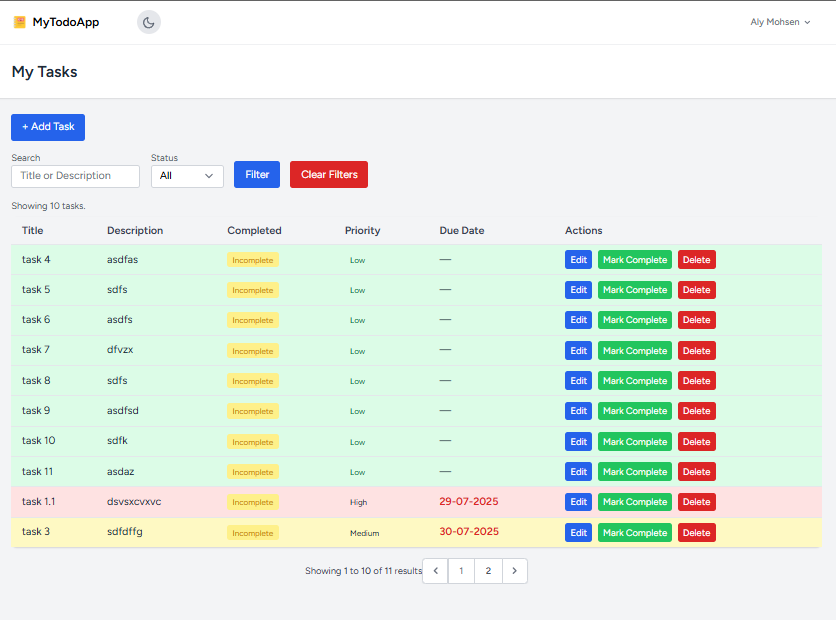

# 📝 Laravel To-Do App

A modern To-Do List web application built with Laravel, Tailwind CSS, and Alpine.js. Easily add, manage, and organize your tasks with features like priority, due dates, search, filtering, and dark mode.

## 🔧 Features

- ✅ Task creation, editing, and deletion
- 📅 Due dates and sorting by deadline
- ⚠️ Priority levels (Low, Medium, High)
- 🔍 Search by title or description
- 🎯 Filter by completion status
- 🌙 Dark mode toggle (with persistence)
- 📱 Responsive layout with mobile support
- 🔔 Flash messages with transitions (Alpine.js)
- 📄 Pagination for large task lists

## 📸 Screenshots

 <!-- Add your own screenshot here -->

## 🚀 Getting Started

### Requirements

- PHP >= 8.1
- Composer
- Node.js & npm
- MySQL/PostgreSQL

### Installation

```bash
git clone https://github.com/yourusername/laravel-todo-app.git
cd laravel-todo-app

# Install backend dependencies
composer install

# Install frontend dependencies
npm install && npm run dev

# Set up environment file
cp .env.example .env
php artisan key:generate

# Configure your DB in .env, then run:
php artisan migrate

# Start the server
php artisan serve
